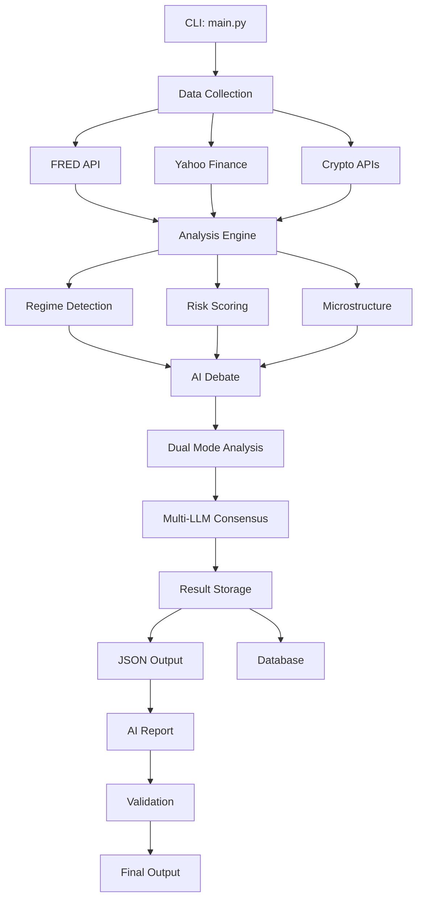

# EIMAS Architecture Documentation
# EIMAS 아키텍처 문서

This document provides a comprehensive overview of the EIMAS (Economic Intelligence Multi-Agent System) architecture, module organization, and design decisions.

---

## Table of Contents

1. [System Overview](#system-overview)
2. [Directory Structure](#directory-structure)
3. [Core Components](#core-components)
4. [Data Flow](#data-flow)
5. [Module Reference](#module-reference)
6. [Design Patterns](#design-patterns)
7. [Configuration](#configuration)
8. [Future Plans](#future-plans)

---

## 1. System Overview

### 1.1 Mission Statement

EIMAS is an AI-native macroeconomic risk analysis and portfolio strategy system that solves the "Black Box" problem in financial AI through:

- **Multi-Agent Debate**: 7 specialized AI agents with distinct perspectives
- **Multi-LLM Consensus**: Cross-validation using Claude, GPT-4, and Gemini
- **Traceable Decisions**: Full reasoning chain for every recommendation
- **Quantitative Rigor**: Advanced econometric models (LASSO, GARCH, VPIN)

### 1.2 Key Capabilities

| Capability | Description |
|------------|-------------|
| **Regime Detection** | GMM-based market state classification |
| **Risk Scoring** | Composite 68-indicator risk assessment |
| **Fed Rate Prediction** | LASSO-based interest rate forecasting |
| **Portfolio Optimization** | Graph-Clustered HRP allocation |
| **Real-time Monitoring** | VPIN/OFI market microstructure analysis |
| **AI Reports** | LLM-powered narrative report generation |

---

## 2. Directory Structure

```
eimas/
├── main.py                 # 🚀 Primary entry point (CLI)
├── api/                    # FastAPI backend server
│   ├── main.py            #    API server entry point
│   ├── routes/            #    API route handlers
│   └── models/            #    Request/response models
│
├── agents/                 # 🤖 AI Agent implementations
│   ├── orchestrator.py    #    MetaOrchestrator (central coordinator)
│   ├── analysis_agent.py  #    Critical Path analysis
│   ├── forecast_agent.py  #    LASSO prediction
│   ├── research_agent.py  #    Web research (Perplexity)
│   ├── strategy_agent.py  #    Portfolio strategy
│   └── base_agent.py      #    Base agent interface
│
├── core/                   # ⚙️ Core system infrastructure
│   ├── schemas.py         #    Agent communication schemas
│   ├── debate.py          #    Debate protocol implementation
│   ├── config.py          #    System configuration
│   ├── database.py        #    Database connections
│   └── logging_config.py  #    Logging setup
│
├── pipeline/               # 🔄 Modular analysis pipeline
│   ├── __init__.py        #    Pipeline exports
│   ├── schemas.py         #    Result data schemas (EIMASResult)
│   ├── analyzers.py       #    Analysis functions
│   ├── collectors.py      #    Data collection functions
│   ├── debate.py          #    Debate runner
│   ├── storage.py         #    Result persistence
│   └── report.py          #    Report generation
│
├── lib/                    # 📚 Business logic library
│   ├── __init__.py        #    Library exports
│   ├── collectors/        #    Data collection modules
│   │   ├── base.py        #      BaseCollector interface
│   │   └── __init__.py    #      Collector exports
│   ├── analyzers/         #    Analysis engine modules
│   │   ├── base.py        #      BaseAnalyzer interface
│   │   └── __init__.py    #      Analyzer exports
│   ├── reports/           #    Report generation modules
│   ├── strategies/        #    Portfolio strategy modules
│   ├── db/                #    Database interface modules
│   ├── utils/             #    Utility functions
│   │
│   ├── critical_path.py   #    Risk scoring aggregator
│   ├── regime_detector.py #    Market regime detection
│   ├── bubble_detector.py #    Bubble risk analysis
│   ├── microstructure.py  #    VPIN, Kyle's Lambda
│   ├── lasso_model.py     #    LASSO regression
│   └── ...                #    70+ analysis modules
│
├── frontend/               # 🌐 Next.js web dashboard
│   ├── app/               #    App router pages
│   ├── components/        #    React components
│   └── lib/               #    Frontend utilities
│
├── data/                   # 💾 Data storage
│   ├── *.db               #    SQLite databases
│   └── *.csv              #    Cached data files
│
├── outputs/                # 📁 Analysis outputs
│   ├── eimas_*.json       #    Unified JSON results
│   ├── eimas_*.md         #    Markdown summaries
│   └── reports/           #    AI-generated reports
│
├── docs/                   # 📖 Documentation
│   ├── architecture/      #    Design documents
│   ├── features/          #    Feature specifications
│   └── manuals/           #    User guides
│
├── tests/                  # 🧪 Test suites
│   ├── test_*.py          #    Unit tests
│   └── test_integration.py#    Integration tests
│
└── configs/                # ⚡ Configuration files
    └── default.yaml       #    Default settings
```

---

## 3. Core Components

### 3.1 Pipeline Architecture

The analysis pipeline is organized into 8 phases:

```
┌─────────────────────────────────────────────────────────────┐
│                    EIMAS Analysis Pipeline                   │
├─────────────────────────────────────────────────────────────┤
│                                                             │
│  ┌─────────┐    ┌─────────┐    ┌─────────┐    ┌─────────┐  │
│  │ Phase 1 │    │ Phase 2 │    │ Phase 3 │    │ Phase 4 │  │
│  │  Data   │───▶│Analysis │───▶│ Debate  │───▶│Realtime │  │
│  │Collect  │    │ Engine  │    │  (AI)   │    │ Stream  │  │
│  └─────────┘    └─────────┘    └─────────┘    └─────────┘  │
│       │              │              │              │        │
│       ▼              ▼              ▼              ▼        │
│  ┌─────────┐    ┌─────────┐    ┌─────────┐    ┌─────────┐  │
│  │ Phase 5 │    │ Phase 6 │    │ Phase 7 │    │ Phase 8 │  │
│  │ Storage │◀───│ Report  │◀───│Validate │◀───│Multi-LLM│  │
│  │  (DB)   │    │  (AI)   │    │  Check  │    │ Verify  │  │
│  └─────────┘    └─────────┘    └─────────┘    └─────────┘  │
│                                                             │
└─────────────────────────────────────────────────────────────┘
```

### 3.2 Agent System

The multi-agent system consists of 7 specialized agents:

| Agent | Role | Key Methods |
|-------|------|-------------|
| **MetaOrchestrator** | Central coordinator | `run_with_debate()` |
| **AnalysisAgent** | Critical Path analysis | `run_critical_path_analysis()` |
| **ForecastAgent** | LASSO prediction | `run_lasso_forecast()` |
| **ResearchAgent** | Web research | `search_policy_context()` |
| **StrategyAgent** | Portfolio strategy | `recommend_portfolio()` |
| **VerificationAgent** | Result validation | `verify_report()` |
| **InterpretationDebateAgent** | Economic school debate | `debate_interpretation()` |

### 3.3 Schema System

Two schema files define the data structures:

- **`core/schemas.py`**: Agent communication (AgentRequest, AgentResponse, Consensus)
- **`pipeline/schemas.py`**: Analysis results (EIMASResult, FREDSummary, RegimeResult)

```python
# Example: Using EIMASResult
from pipeline.schemas import EIMASResult

result = EIMASResult(timestamp="2026-01-30T12:00:00")
result.risk_score = 65.3
result.final_recommendation = "HOLD"

# Serialize to JSON
json_data = result.to_dict()

# Generate markdown report
markdown = result.to_markdown()
```

---

## 4. Data Flow

### 4.1 Main Pipeline Flow



### 4.2 Database Schema

| Database | Purpose | Key Tables |
|----------|---------|------------|
| `trading.db` | Trading signals | `signals`, `paper_trades` |
| `events.db` | Economic events | `events`, `predictions` |
| `unified_store.db` | Cached data | `market_cache`, `fred_cache` |

---

## 5. Module Reference

### 5.1 lib/collectors (Data Collection)

| Module | Class | Description |
|--------|-------|-------------|
| `data_collector.py` | `DataManager` | Main data manager |
| `fred_collector.py` | `FREDCollector` | Federal Reserve data |
| `crypto_collector.py` | `CryptoCollector` | Cryptocurrency data |
| `extended_data_sources.py` | `ExtendedDataCollector` | DeFi, options, etc. |

### 5.2 lib/analyzers (Analysis Engines)

| Module | Class | Key Methods |
|--------|-------|-------------|
| `regime_detector.py` | `RegimeDetector` | `detect_regime()` |
| `bubble_detector.py` | `BubbleDetector` | `analyze_bubble_risk()` |
| `microstructure.py` | `MicrostructureAnalyzer` | `calculate_vpin()` |
| `liquidity_analysis.py` | `LiquidityMarketAnalyzer` | `analyze_causality()` |

### 5.3 lib/strategies (Portfolio)

| Module | Class | Description |
|--------|-------|-------------|
| `portfolio_optimizer.py` | `MSTAnalyzer` | MST-based clustering |
| `adaptive_agents.py` | `AdaptivePortfolioAgents` | Risk-profile portfolios |
| `risk_manager.py` | `RiskManager` | Position sizing |

---

## 6. Design Patterns

### 6.1 Applied Patterns

| Pattern | Usage | Location |
|---------|-------|----------|
| **Strategy** | Interchangeable analyzers | `lib/analyzers/base.py` |
| **Template Method** | Collector workflow | `lib/collectors/base.py` |
| **Observer** | Real-time signals | `lib/binance_stream.py` |
| **Facade** | Pipeline abstraction | `pipeline/__init__.py` |

### 6.2 SOLID Principles

- **Single Responsibility**: Each analyzer handles one analysis type
- **Open/Closed**: Base interfaces allow extension without modification
- **Interface Segregation**: Separate collector/analyzer interfaces
- **Dependency Inversion**: Pipeline depends on abstractions, not implementations

---

## 7. Configuration

### 7.1 Environment Variables

```bash
# .env file
ANTHROPIC_API_KEY=sk-...      # Claude API (required)
OPENAI_API_KEY=sk-...         # GPT-4 API (optional)
GOOGLE_API_KEY=...            # Gemini API (optional)
FRED_API_KEY=...              # FRED data (required)
PERPLEXITY_API_KEY=...        # Research agent (optional)
```

### 7.2 Runtime Options

```bash
python main.py --short    # Skip heavy analysis
python main.py --full     # All features (API costs)
python main.py --realtime # Include streaming
```

---

## 8. Future Plans

### 8.1 Planned Features (미구현 계획)

- [ ] **Web Dashboard Improvements**: Real-time chart updates
- [ ] **Mobile App**: React Native companion app
- [ ] **Backtesting Engine**: Strategy backtesting framework
- [ ] **Alert System**: Push notifications for signals

### 8.2 Technical Debt

- [ ] Migrate remaining lib/ files to submodule structure
- [ ] Add comprehensive unit test coverage
- [ ] Implement async throughout pipeline

---

## Contributing

See [CONTRIBUTING.md](./CONTRIBUTING.md) for development guidelines.

---

*Last Updated: 2026-01-30*
*EIMAS Development Team*
